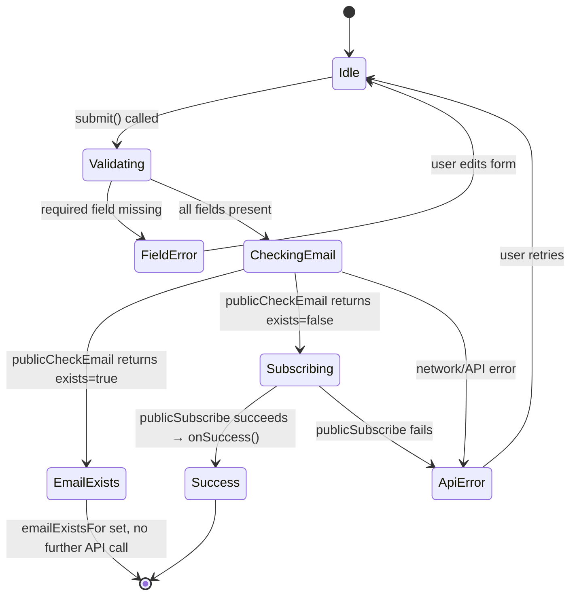
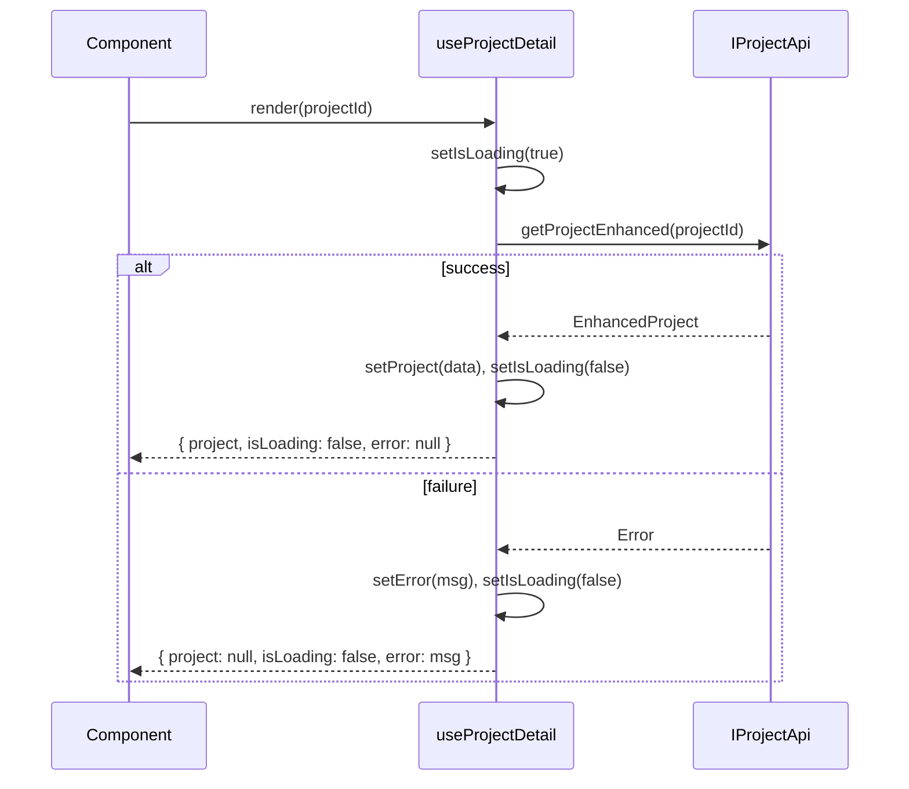
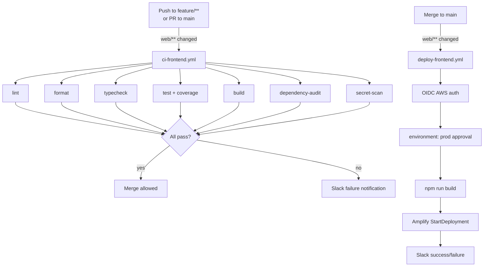

# Design Document — web-frontend-quality

## Overview

This design establishes frontend quality infrastructure for the `ugsys-projects-registry` web SPA (`web/`). The work spans seven areas: git pre-commit hooks, a CI pipeline, an Amplify deploy workflow, an architecture refactor (hook extraction + service ports), a vitest test suite with 80% coverage gate, ESLint/Prettier improvements, and logger/token security hardening.

The existing stack is React 19, TypeScript strict, Vite 6, Tailwind 4, nanostores, react-router-dom 7. The reference pattern for vitest and Amplify deployment comes from `devsecops-poc/web`.

---

## Architecture

### Layered Frontend Architecture

The hexagonal architecture principles apply in spirit to the frontend:

```
┌─────────────────────────────────────────────────────────┐
│  Pages / Components  (presentation)                      │
│  SubscribePage, HomePage, DashboardPage, …               │
├─────────────────────────────────────────────────────────┤
│  Hooks  (application layer)                              │
│  useProjects, useProjectDetail, usePublicSubscribe, …    │
├─────────────────────────────────────────────────────────┤
│  Service Ports  (outbound port interfaces)               │
│  IProjectApi, ISubscriptionApi  (src/services/ports.ts)  │
├─────────────────────────────────────────────────────────┤
│  Concrete Services  (adapters)                           │
│  projectApi, subscriptionApi  → httpClient               │
└─────────────────────────────────────────────────────────┘
```

- Pages are thin — they render and delegate to hooks.
- Hooks own all state and side-effect orchestration.
- Ports (TypeScript interfaces) decouple hooks from concrete API modules, enabling DI in tests.
- Concrete services implement ports by calling `httpClient`.

### Token Security Architecture

```
┌──────────────┐   getAccessToken()   ┌──────────────────┐
│  httpClient  │ ──────────────────→  │   authStore      │
│              │                      │  (in-memory var) │
└──────────────┘                      └──────────────────┘
                                             ↑
                                      login() sets token
                                      logout() clears token
                                      NO localStorage writes
```

Tokens are held in module-level variables inside `authStore.ts`. `httpClient` imports a `getAccessToken` getter from `authStore` instead of reading `localStorage` directly.

### Data Flow — usePublicSubscribe



### Data Flow — useProjectDetail



### CI/CD Pipeline Architecture



---

## Components and Interfaces

### Service Ports — `src/services/ports.ts`

```typescript
import type { PaginatedResponse } from '../types/api';
import type { Project } from '../types/project';
import type { Subscription } from '../types/project';

export interface IProjectApi {
  getPublicProjects(page?: number, pageSize?: number): Promise<PaginatedResponse<Project>>;
  getProject(id: string): Promise<Project>;
  getProjectEnhanced(id: string): Promise<Project>;
}

export interface ISubscriptionApi {
  subscribe(projectId: string, notes?: string): Promise<Subscription>;
  checkSubscription(
    personId: string,
    projectId: string,
  ): Promise<{ exists: boolean; subscription?: Subscription }>;
  getMySubscriptions(personId: string): Promise<Subscription[]>;
  publicCheckEmail(email: string): Promise<{ exists: boolean }>;
  publicSubscribe(data: {
    email: string;
    first_name: string;
    last_name: string;
    project_id: string;
    notes?: string;
  }): Promise<{ subscription_id: string }>;
  publicRegister(data: {
    email: string;
    full_name: string;
    password: string;
  }): Promise<void>;
}
```

The concrete `projectApi` and `subscriptionApi` modules satisfy these interfaces implicitly (TypeScript structural typing). No changes to their implementations are required.

### Hook: `useProjectDetail` — `src/hooks/useProjectDetail.ts`

```typescript
import type { IProjectApi } from '../services/ports';
import type { FormSchema } from '../types/form';
import type { Project } from '../types/project';

export type EnhancedProject = Project & { form_schema?: FormSchema };

export interface UseProjectDetailResult {
  project: EnhancedProject | null;
  isLoading: boolean;
  error: string | null;
}

export function useProjectDetail(
  projectId: string | undefined,
  api: IProjectApi = projectApi,
): UseProjectDetailResult
```

Behavior:
- On mount (and when `projectId` changes), calls `api.getProjectEnhanced(projectId)`.
- Returns `isLoading: true` during the fetch.
- On success, sets `project` to the resolved value.
- On failure, sets `error` to the error message string.
- Uses a `cancelled` flag to prevent state updates after unmount.

### Hook: `usePublicSubscribe` — `src/hooks/usePublicSubscribe.ts`

```typescript
import type { ISubscriptionApi } from '../services/ports';

export interface PublicSubscribeFormData {
  email: string;
  firstName: string;
  lastName: string;
  notes: string;
}

export interface UsePublicSubscribeResult {
  submit: (projectId: string, data: PublicSubscribeFormData) => Promise<void>;
  isSubmitting: boolean;
  apiError: string | null;
  fieldErrors: Record<string, string>;
  emailExistsFor: string | null;
}

export function usePublicSubscribe(
  onSuccess: (result: { subscription_id?: string }) => void,
  api: ISubscriptionApi = subscriptionApi,
): UsePublicSubscribeResult
```

Behavior:
- `submit` validates required fields (`email`, `firstName`, `lastName`) first. If any are empty/whitespace, sets `fieldErrors` and returns without calling any API.
- If validation passes, calls `api.publicCheckEmail(email)`.
  - If `exists === true`: sets `emailExistsFor` to the email, does NOT call `publicSubscribe`.
  - If `exists === false`: calls `api.publicSubscribe(...)`, then invokes `onSuccess`.
- Sets `isSubmitting` to `true` during async operations, `false` in `finally`.
- Sets `apiError` on any caught exception.

### Component: `PublicSubscribeForm` — `src/components/subscriptions/PublicSubscribeForm.tsx`

Extracted from `SubscribePage.tsx`. Receives `UsePublicSubscribeResult` as props plus `projectId: string`. Contains only rendering logic — no state, no API calls.

```typescript
interface PublicSubscribeFormProps extends UsePublicSubscribeResult {
  projectId: string;
}
```

### Refactored `SubscribePage` — `src/pages/SubscribePage.tsx`

After refactor:
- Uses `useProjectDetail(projectId)` for project fetching.
- Uses `usePublicSubscribe(handleSuccess)` for the public flow.
- Passes `usePublicSubscribe` result to `<PublicSubscribeForm>`.
- Contains zero inline API calls or form-submission logic.

### Logger — `src/utils/logger.ts`

```typescript
export interface ErrorTracker {
  captureError(message: string, data?: unknown): void;
}

// No-op default — never throws
const noopTracker: ErrorTracker = {
  captureError: () => undefined,
};

let _tracker: ErrorTracker = noopTracker;

export function configureLogger(tracker: ErrorTracker): void {
  _tracker = tracker;
}

export const logger = {
  debug: (message: string, data?: unknown) => log('debug', message, data),
  info:  (message: string, data?: unknown) => log('info',  message, data),
  warn:  (message: string, data?: unknown) => log('warn',  message, data),
  error: (message: string, data?: unknown) => {
    log('error', message, data);
    if (!isDev) {
      _tracker.captureError(message, data);
    }
  },
};
```

### Token Security — `src/stores/authStore.ts`

```typescript
// Module-level in-memory storage — never written to localStorage
let _accessToken: string | null = null;
let _refreshToken: string | null = null;

/** Called by httpClient — reads from memory, not localStorage */
export function getAccessToken(): string | null {
  return _accessToken;
}

export function getRefreshToken(): string | null {
  return _refreshToken;
}

export async function login(email: string, password: string): Promise<void> {
  $isLoading.set(true);
  try {
    const tokens: TokenPair = await authService.login(email, password);
    _accessToken = tokens.access_token;
    _refreshToken = tokens.refresh_token;
    // localStorage.setItem calls REMOVED
    const user = extractUser(tokens.access_token);
    $user.set(user);
  } finally {
    $isLoading.set(false);
  }
}

export async function logout(): Promise<void> {
  _accessToken = null;
  _refreshToken = null;
  $user.set(null);
  try {
    await httpClient.post('/api/v1/auth/logout');
  } catch {
    // best-effort — session already cleared client-side
  }
  window.location.href = '/';
}
```

`httpClient.ts` changes:
- Remove `getAccessToken()` and `getRefreshToken()` local functions.
- Import `getAccessToken, getRefreshToken` from `../stores/authStore`.
- `clearTokens()` sets `_accessToken = null; _refreshToken = null` via exported setters, or calls `logout()`.

### `useProjects` — updated signature

```typescript
export function useProjects(
  page: number,
  pageSize = 12,
  api: IProjectApi = projectApi,
): { projects: Project[]; total: number; isLoading: boolean; error: string | null }
```

---

## Data Models

### `EnhancedProject`

```typescript
// Defined in src/hooks/useProjectDetail.ts (or re-exported from src/types/project.ts)
type EnhancedProject = Project & { form_schema?: FormSchema };
```

### `PublicSubscribeFormData`

```typescript
interface PublicSubscribeFormData {
  email: string;
  firstName: string;
  lastName: string;
  notes: string;
}
```

### Hook return shapes (consistent contract)

All data-fetching hooks return a shape conforming to:

```typescript
interface DataFetchResult<T> {
  isLoading: boolean;
  error: string | null;
  // data field varies by hook: project, projects+total, etc.
}
```

### `ErrorTracker`

```typescript
interface ErrorTracker {
  captureError(message: string, data?: unknown): void;
}
```

---

## Correctness Properties

*A property is a characteristic or behavior that should hold true across all valid executions of a system — essentially, a formal statement about what the system should do. Properties serve as the bridge between human-readable specifications and machine-verifiable correctness guarantees.*

### Property 1: useProjects uses injected API

*For any* mock `IProjectApi`, when `useProjects` is rendered with that mock as the `api` parameter, it calls `api.getPublicProjects` with the given page and pageSize arguments.

**Validates: Requirements 4.3**

---

### Property 2: useProjectDetail data flow

*For any* `projectId` string and any mock `IProjectApi`, when `useProjectDetail` is rendered with that projectId and mock, it calls `api.getProjectEnhanced(projectId)` and returns the resolved project in the `project` field with `isLoading: false` and `error: null` on success.

**Validates: Requirements 4.4, 4.5**

---

### Property 3: usePublicSubscribe email-exists guard

*For any* valid form data (non-empty email, firstName, lastName) where `api.publicCheckEmail` returns `{ exists: true }`, calling `submit` sets `emailExistsFor` to the submitted email and never calls `api.publicSubscribe`.

**Validates: Requirements 4.8**

---

### Property 4: usePublicSubscribe happy path

*For any* valid form data where `api.publicCheckEmail` returns `{ exists: false }` and `api.publicSubscribe` resolves successfully, calling `submit` invokes `api.publicSubscribe` with the correct payload and calls `onSuccess` with the result.

**Validates: Requirements 4.9**

---

### Property 5: usePublicSubscribe field validation guard

*For any* form data where at least one required field (`email`, `firstName`, or `lastName`) is empty or whitespace-only, calling `submit` sets `fieldErrors` to a non-empty object and does not call `api.publicCheckEmail` or `api.publicSubscribe`.

**Validates: Requirements 4.10**

---

### Property 6: escapeHtml character escaping

*For any* string containing one or more of the characters `<`, `>`, `&`, `"`, `'`, `escapeHtml` returns a string where each such character is replaced by its corresponding HTML entity (`&lt;`, `&gt;`, `&amp;`, `&quot;`, `&#039;`).

**Validates: Requirements 5.8a**

---

### Property 7: escapeHtml output safety

*For any* string `s`, `escapeHtml(s)` returns a string that contains none of the raw special HTML characters `<`, `>`, `"`, or `'` — each has been replaced by its HTML entity.

**Validates: Requirements 5.8b**

---

### Property 8: stripHtml tag removal

*For any* string, `stripHtml` returns a string that contains no substrings matching the pattern `<[^>]*>` (i.e., no HTML tags remain).

**Validates: Requirements 5.8c**

---

### Property 9: getErrorMessage extraction

*For any* `Error` instance `e`, `getErrorMessage(e)` returns `e.message`. *For any* value that is not an `Error` instance and does not have a `message` property, `getErrorMessage` returns the fallback string `"Ha ocurrido un error inesperado"`.

**Validates: Requirements 5.9**

---

### Property 10: logger error forwarding in non-dev environment

*For any* error message string and optional data, when a non-noop `ErrorTracker` is configured via `configureLogger` and the environment is non-development, calling `logger.error(message, data)` invokes `tracker.captureError(message, data)` exactly once.

**Validates: Requirements 7.2**

---

### Property 11: tokens not persisted to localStorage after login

*For any* successful `login(email, password)` call, `localStorage.getItem('access_token')` and `localStorage.getItem('refresh_token')` both return `null` after the call completes.

**Validates: Requirements 7.5**

---

### Property 12: logout clears in-memory token

*For any* authenticated state where `getAccessToken()` returns a non-null string, calling `logout()` results in `getAccessToken()` returning `null`.

**Validates: Requirements 7.7**

---

## Error Handling

### Hook error handling

All data-fetching hooks (`useProjects`, `useProjectDetail`) catch errors from API calls and set `error` to a user-facing string. They never let exceptions propagate to the component tree.

```typescript
.catch((e: unknown) => {
  if (!cancelled) {
    setError(e instanceof Error ? e.message : 'Error al cargar datos');
  }
})
```

### usePublicSubscribe error handling

- Field validation errors → `fieldErrors` (no API call made).
- `publicCheckEmail` failure → `apiError` set, `isSubmitting` cleared.
- `publicSubscribe` failure → `apiError` set, `isSubmitting` cleared.
- `finally` block always clears `isSubmitting`.

### httpClient 401 refresh flow

After the token migration to in-memory, the refresh flow in `httpClient` updates `_accessToken` and `_refreshToken` via the exported setters from `authStore` instead of writing to `localStorage`. On refresh failure, calls `logout()` (which clears in-memory tokens and redirects).

### Logger no-op default

`configureLogger` is optional. If never called, `_tracker` remains the no-op implementation, so `logger.error` in production never throws due to a missing tracker.

---

## Testing Strategy

### Dual testing approach

Unit tests cover specific examples, edge cases, and error conditions. Property-based tests verify universal properties across many generated inputs. Both are required.

### Test tooling

- **Test runner**: vitest (configured in `vite.config.ts` `test` block)
- **DOM environment**: jsdom
- **Component testing**: `@testing-library/react`, `@testing-library/user-event`
- **Assertions**: `@testing-library/jest-dom`
- **Property-based testing**: `fast-check` (generates random inputs for properties 6–9)
- **Coverage**: `@vitest/coverage-v8`, thresholds at 80% for lines/functions/branches/statements

### vitest configuration (`vite.config.ts` test block)

```typescript
test: {
  environment: 'jsdom',
  globals: true,
  setupFiles: ['./src/test/setup.ts'],
  include: ['src/**/*.{test,spec}.{ts,tsx}'],
  coverage: {
    provider: 'v8',
    thresholds: {
      lines: 80,
      functions: 80,
      branches: 80,
      statements: 80,
    },
  },
},
```

### Test file layout

```
web/src/
├── test/
│   └── setup.ts                          # imports @testing-library/jest-dom
├── hooks/
│   ├── useProjects.test.ts
│   ├── useProjectDetail.test.ts
│   └── usePublicSubscribe.test.ts
├── utils/
│   ├── sanitize.test.ts                  # includes fast-check property tests
│   ├── errorHandling.test.ts
│   └── logger.test.ts
└── components/
    └── subscriptions/
        └── PublicSubscribeForm.test.tsx
```

### Unit test plan per module

**`usePublicSubscribe.test.ts`**
- Field validation: empty email → fieldErrors set, no API called
- Field validation: whitespace-only firstName → fieldErrors set, no API called
- Email-exists path: publicCheckEmail returns exists=true → emailExistsFor set, publicSubscribe not called
- Happy path: publicCheckEmail returns exists=false → publicSubscribe called, onSuccess invoked
- API error: publicCheckEmail throws → apiError set, isSubmitting false
- isSubmitting transitions: true during async, false after

**`useProjectDetail.test.ts`**
- Loading state: isLoading true during fetch, false after
- Success: project set to resolved EnhancedProject
- Error: error string set on API failure
- Cleanup: no state update after unmount (cancelled flag)

**`useProjects.test.ts`**
- Loading state transitions
- Success: projects and total set from paginated response
- Error: error string set on API failure
- DI: injected mock api is called with correct page/pageSize

**`sanitize.test.ts`** (unit + property-based)
- Unit: escapeHtml('<script>') → '&lt;script&gt;'
- Unit: escapeHtml('a & b') → 'a &amp; b'
- Unit: stripHtml('<p>hello</p>') → 'hello'
- Unit: stripHtml('no tags') → 'no tags'
- Property (fast-check): escapeHtml idempotence — `fc.string()` → assert `escapeHtml(escapeHtml(s)) === escapeHtml(s)`
- Property (fast-check): escapeHtml escapes all special chars — generate strings with `<>&"'` → assert entities present
- Property (fast-check): stripHtml result contains no tags — `fc.string()` → assert no `/<[^>]*>/` match

**`errorHandling.test.ts`**
- getErrorMessage(new Error('msg')) → 'msg'
- getErrorMessage({ message: 'api msg' }) → 'api msg'
- getErrorMessage(null) → fallback string
- isApiError({ error: 'NOT_FOUND' }) → true
- isApiError({ error: 'NOT_FOUND' }, 'NOT_FOUND') → true
- isApiError({ error: 'NOT_FOUND' }, 'CONFLICT') → false
- isApiError(null) → false

**`logger.test.ts`**
- configureLogger + logger.error in non-dev → captureError called once
- logger.error without configureLogger → does not throw
- logger.error in dev environment → captureError NOT called

### Property-based test configuration

Each property test uses `fast-check` with minimum 100 runs:

```typescript
// Feature: web-frontend-quality, Property 7: escapeHtml idempotence
it('escapeHtml is idempotent for any string', () => {
  fc.assert(
    fc.property(fc.string(), (s) => {
      expect(escapeHtml(escapeHtml(s))).toBe(escapeHtml(s));
    }),
    { numRuns: 100 },
  );
});
```

Tag format for all property tests: `// Feature: web-frontend-quality, Property N: <property_text>`

### CI coverage gate

`npm run test:coverage` runs vitest with `--coverage`. If any threshold (lines/functions/branches/statements) falls below 80%, the command exits non-zero and the CI `test` job fails, blocking merge.

---

## File Change Summary

### New files

| Path | Purpose |
|------|---------|
| `web/src/services/ports.ts` | `IProjectApi`, `ISubscriptionApi` interfaces |
| `web/src/hooks/useProjectDetail.ts` | Project detail fetching hook |
| `web/src/hooks/usePublicSubscribe.ts` | Public subscription flow hook |
| `web/src/components/subscriptions/PublicSubscribeForm.tsx` | Extracted form component |
| `web/src/test/setup.ts` | jest-dom setup |
| `web/.prettierrc` | Prettier config |
| `web/amplify.yml` | Amplify static SPA deploy config |
| `.github/workflows/ci-frontend.yml` | Frontend CI pipeline |
| `.github/workflows/deploy-frontend.yml` | Amplify deploy workflow |

### Modified files

| Path | Change |
|------|--------|
| `web/src/stores/authStore.ts` | Remove localStorage writes; add in-memory vars + getters |
| `web/src/services/httpClient.ts` | Import token getters from authStore instead of localStorage |
| `web/src/utils/logger.ts` | Add `ErrorTracker` interface, `configureLogger`, forward errors |
| `web/src/hooks/useProjects.ts` | Add optional `api: IProjectApi` parameter |
| `web/src/pages/SubscribePage.tsx` | Use `useProjectDetail` + `usePublicSubscribe`; remove inline logic |
| `web/vite.config.ts` | Add `test` block for vitest |
| `web/eslint.config.js` | Add react-hooks, jsx-a11y, react plugins |
| `web/package.json` | Add devDependencies + new scripts |
| `scripts/hooks/pre-commit` | Add web/ staged-file detection and checks |
| `justfile` | Add `web-test` and `web-audit` recipes |
